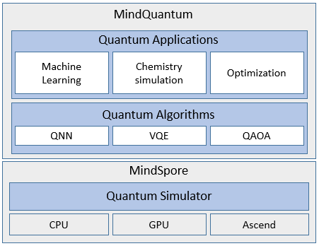

# Variational Quantum Eigensolver(VQE) example by MindQuantum
The variational quantum eigensolver is a hybridclassical-quantum algorithm that variationally determines the ground state energy of a Hamiltonian. In this tutorial, I am going to implement VQE for finding the ground state energy of  by mindquantum.

MindQuantum is general quantum computing framework designed by [Mindspore](https://www.mindspore.cn/en) and [Hiq](https://hiq.huaweicloud.com/). MindQuantum can efficiently solve problem such as quantum machine learning, quantum chemistry simulation and so on.

