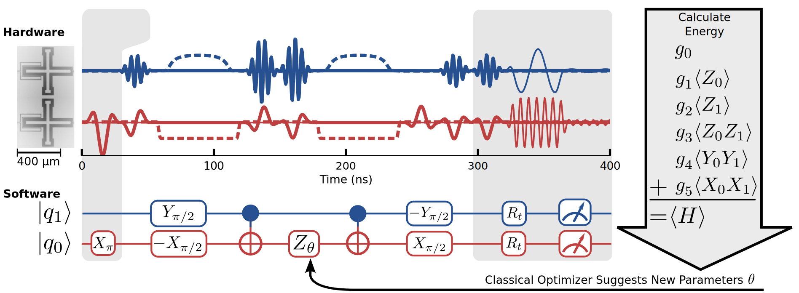

# Variational Quantum Eigensolver(VQE) example by MindQuantum
The variational quantum eigensolver is a hybridclassical-quantum algorithm that variationally determines the ground state energy of a Hamiltonian. In this tutorial, I am going to implement VQE for finding the ground state energy of  by mindquantum.

MindQuantum is general quantum computing framework designed by [Mindspore](https://www.mindspore.cn/en) and [Hiq](https://hiq.huaweicloud.com/). MindQuantum can efficiently solve problem such as quantum machine learning, quantum chemistry simulation and so on.

<p align="center">
  
</p>

The problem we want to tackle is based on Ref. [[1]](#1). In this paper, O'Malley reported that their first experiment demonstrated the VQE proposed in 2014 [[2]](#2) on a real quantum computer. The schematic I am going to reproduce is the following, and I will implement the "software".

<p align="center">
  
</p>
<h3 align="center"> The figure is taken from Ref. [1] </h3>

The molecular hydrogen Hamiltonian is 
<p align="center">  </p>
where {X_i, Z_i, Y_i} denote Pauli matrices acting on the *i*th qubit and the real scalars {g_i} are efficiently computable functions of hydrogen-hydrogen bond length R. Let’s build a Hamiltonian for the H2 molecule with different bond length. Firstly, we import mindquantum package.

```python
import mindquantum as mq
```
Defind the function for Hamiltonian:

```python
def hamiltonian(coeff):
    a, b, c, d, e, f = coeff
    h = mq.QubitOperator('', a) + mq.QubitOperator("Z0", b) + mq.QubitOperator("Z1", c) + mq.QubitOperator("Z0 Z1", d) + mq.QubitOperator("Y0 Y1", e) + mq.QubitOperator("X0 X1", f)
    return mq.Hamiltonian(h)
```
Then we should prepare the ansatz. The ansatz for our problem is 
<p align="center">  </p>

```python
from mindquantum.core.operators import TimeEvolution
# Initial Hartree Fock state
hf = mq.Circuit()
hf += mq.X.on(0)
# Create ansatz circuit
u = mq.QubitOperator("X0 Y1", 't')
ansatz_circuit = TimeEvolution(u, 1.0).circuit
```
The quantum circuit for ansatz is shown:
<p align="center">
  
</p>
We compute the expectation for Hamiltonian as 
<p align="center"> . </p>
By varying the parameters, we can find a minimum value , which represents the VQE approximation to ground state energy of hydrogen molecule.

```python
from mindquantum.algorithm.nisq.chem import Transform
from mindquantum.framework import MQAnsatzOnlyLayer
from mindspore.common.parameter import Parameter
import numpy as np
import matplotlib.pyplot as plt

def plot_scatter(x, y):
    plt.figure(facecolor='w')
    plt.minorticks_on()
    plt.scatter(x, y, marker='o', c='r', label="VQE")
    plt.xlabel("Bond Length "r"$R$")
    plt.ylabel("Total Energy(hartree)")
    plt.legend()
    #plt.title("Energy surface of molecular hydrogen as determined by VQE")
    plt.savefig("H2 energy.pdf")
    return None
    
def vqe(total_circuit, all_coeff, dist, init_amp=[0.0]):
    #all_iter_list = []; 
    Ei_min_list = []
    for _, coeff in enumerate(all_coeff):
        hh = hamiltonian(coeff)
        grad_ops = mq.Simulator("projectq", total_circuit.n_qubits).get_expectation_with_grad(hh, total_circuit)
        pqcent = MQAnsatzOnlyLayer(grad_ops)
        pqcent.weight = Parameter(ms.Tensor(init_amp, pqcent.weight.dtype) )
        
        init_E = pqcent()
        
        optimzer = ms.nn.Adagrad(pqcent.trainable_params(), learning_rate=4e-2)
        train_pqcent = ms.nn.TrainOneStepCell(pqcent, optimzer)
        
        eps = 1.e-8
        E_diff = eps * 1e3
        E_last = init_E.asnumpy() + E_diff
        
        iter_idx = 0
        #iter_list = []
        Ei_list = []
        
        
        while abs(E_diff) > eps:
            Ei = train_pqcent().asnumpy()
        
            if iter_idx % 5 == 0:
                #iter_list.append(iter_idx)
                Ei_list.append(Ei)
            E_diff = E_last - Ei
            E_last = Ei
            iter_idx += 1
        #all_iter_list.append(iter_list)
        Ei_min_list.append(min(Ei_list) )
    plot_scatter(dist, Ei_min_list)
    
    return None
```
Runing the code we design above, we get the result.
<p align="center">
  
</p>


## Reference
<a id="1">[1]</a> 
[O’Malley, Peter JJ, et al. "Scalable quantum simulation of molecular energies." Physical Review X 6.3 (2016): 031007.](https://journals.aps.org/prx/abstract/10.1103/PhysRevX.6.031007)

<a id="2">[2]</a>
[Peruzzo, Alberto, et al. "A variational eigenvalue solver on a photonic quantum processor." Nature communications 5.1 (2014): 1-7.](https://www.nature.com/articles/ncomms5213)
